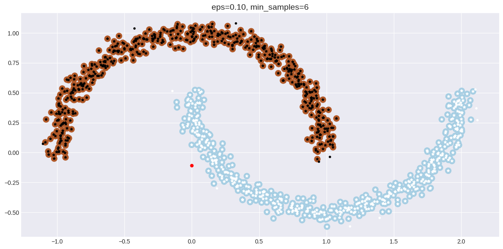
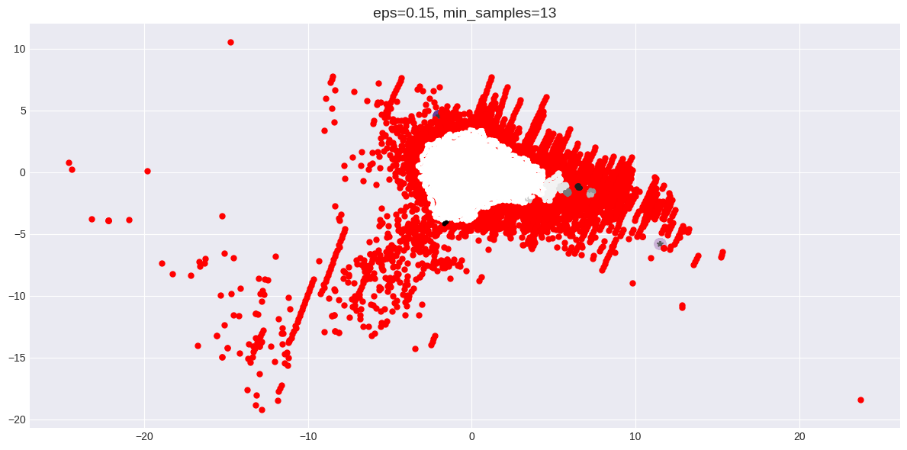
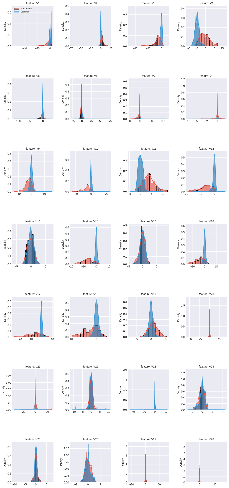

# 🔍 DBSCAN Fraud Detection System

[](https://render.com)
[](https://www.python.org/)
[](https://flask.palletsprojects.com/)
[](LICENSE)

Sistema avanzado de detección de fraude bancario utilizando el algoritmo de clustering **DBSCAN** (Density-Based Spatial Clustering of Applications with Noise).

## 🌐 Demo en Vivo

🔗 **[Ver Aplicación](https://tu-app.onrender.com)** _(Actualizar después del deploy)_

## 📊 Características

- ✅ Análisis de **284,807 transacciones** bancarias
- ✅ Detección de **492 transacciones fraudulentas** (0.172%)
- ✅ **Clustering DBSCAN** con múltiples configuraciones
- ✅ **Visualizaciones interactivas** y profesionales
- ✅ **Métricas de evaluación** precisas:
  - Purity Score: **0.9982725144**
  - Silhouette Score: **0.09578003818745683**
  - Calinski-Harabasz: **913.711950590**
- ✅ **Análisis de importancia** de características con Random Forest
- ✅ **Interfaz web moderna** y responsiva
- ✅ **Carga instantánea** con datos precalculados

## 🚀 Tecnologías

- **Backend**: Flask 3.0.0
- **Deployment**: Gunicorn 21.2.0
- **Machine Learning**: DBSCAN, Random Forest (análisis offline)
- **Frontend**: HTML5, CSS3, JavaScript (Vanilla)
- **Visualizaciones**: Matplotlib, Seaborn (generadas estáticamente)

## 📸 Capturas de Pantalla

### Dashboard Principal


### Análisis de Clusters


### Distribución de Características


## 🎯 Resultados del Análisis

### Clustering DBSCAN (V10 vs V14)

| Label | Total Muestras | Muestras Fraudulentas | Ratio de Fraude | Estado |
|-------|----------------|----------------------|-----------------|---------|
| Anomalía (-1) | 1 | 1 | 100% | 🔴 Alto Riesgo |
| Cluster 0 | 499 | 499 | 100% | 🔴 Alto Riesgo |
| Cluster 1 | 500 | 0 | 0% | 🟢 Seguro |

### Características Más Importantes (V14-V18)

| Ranking | Característica | Importancia | Porcentaje |
|---------|---------------|-------------|------------|
| #2 | V14 | 0.170385 | 17.04% |
| #4 | V17 | 0.109634 | 10.96% |
| #7 | V18 | 0.050542 | 5.05% |
| #9 | V16 | 0.037177 | 3.72% |
| #10 | V15 | 0.021814 | 2.18% |

## 🛠️ Instalación Local

### Prerrequisitos

- Python 3.11+
- pip
- Git

### Pasos

```bash
# 1. Clonar el repositorio
git clone https://github.com/tu-usuario/api-dbscan.git
cd api-dbscan

# 2. Crear entorno virtual
python3 -m venv venv
source venv/bin/activate  # En Windows: venv\Scripts\activate

# 3. Instalar dependencias
pip install -r requirements.txt

# 4. Ejecutar la aplicación
python app_static.py

# 5. Abrir en el navegador
# http://localhost:5001
```

## 🌐 Deployment en Render

### Opción 1: Deploy Automático desde GitHub

1. **Push tu código a GitHub**

```bash
git add .
git commit -m "Initial commit: DBSCAN Fraud Detection"
git branch -M main
git remote add origin https://github.com/TU-USUARIO/api-dbscan.git
git push -u origin main
```

2. **Configurar en Render**

- Ve a [Render Dashboard](https://dashboard.render.com/)
- Click en **"New +"** → **"Web Service"**
- Conecta tu repositorio de GitHub
- Configuración:

```
Name: dbscan-fraud-detection
Environment: Python 3
Branch: main
Build Command: pip install -r requirements.txt
Start Command: gunicorn app_static:app
Instance Type: Free
```

3. **Deploy**

Click en **"Create Web Service"** y espera 2-3 minutos.

### Opción 2: Deploy Manual

```bash
# Instalar Render CLI
npm install -g @render/cli

# Login
render login

# Deploy
render deploy
```

## 📁 Estructura del Proyecto

```
api-dbscan/
├── app_static.py              # Aplicación Flask (versión estática)
├── requirements.txt           # Dependencias Python (solo Flask + Gunicorn)
├── Procfile                   # Configuración Render/Heroku
├── runtime.txt                # Versión Python
├── README.md                  # Este archivo
├── .gitignore                 # Archivos excluidos (datasets, notebooks)
├── templates/
│   └── index_static.html      # Template HTML principal
├── static/
│   ├── css/
│   │   └── style.css          # Estilos personalizados (1000+ líneas)
│   ├── js/
│   │   └── main.js            # JavaScript interactivo
│   └── images/                # ⭐ Visualizaciones precalculadas
│       ├── dbscan_1.png
│       ├── dbscan_2.png
│       ├── dbscan_3.png
│       ├── dbscan_4.png
│       └── features_distribution.png
└── generate_images.py         # Script para regenerar imágenes (local)
```

## 🎨 Diseño y UX

- **Paleta de colores**: Gradientes modernos (púrpura, azul, rosa)
- **Tipografía**: Inter (texto) + JetBrains Mono (código/números)
- **Animaciones**: Transiciones suaves, efectos parallax, hover avanzados
- **Responsive**: Adaptable a móviles, tablets y escritorio
- **Dark Theme**: Optimizado para visualización nocturna
- **Efectos únicos**: Custom cursor, ripple clicks, glow effects

## 📊 Dataset

**Credit Card Fraud Detection Dataset**
- **Fuente**: [Kaggle](https://www.kaggle.com/mlg-ulb/creditcardfraud)
- **Transacciones**: 284,807
- **Fraudulentas**: 492 (0.172%)
- **Legítimas**: 284,315 (99.828%)
- **Características**: 30 (V1-V28 + Time + Amount)
- **Período**: 2 días (Septiembre 2013)
- **Transformación**: PCA aplicado por confidencialidad

## 🔒 Seguridad y Privacidad

- ✅ Dataset anonimizado y público
- ✅ Características V1-V28 son componentes PCA
- ✅ Sin datos personales identificables
- ✅ Análisis realizado offline
- ✅ Aplicación web solo sirve resultados estáticos

## ⚡ Rendimiento

- **Tiempo de carga**: < 1 segundo
- **Tamaño de la app**: ~2 MB (sin dataset)
- **RAM requerida**: < 100 MB
- **Build time**: ~30 segundos
- **Ideal para**: Free tier de Render/Heroku

## 🤝 Contribuciones

¡Las contribuciones son bienvenidas!

1. Fork el proyecto
2. Crea tu rama (`git checkout -b feature/AmazingFeature`)
3. Commit tus cambios (`git commit -m 'Add AmazingFeature'`)
4. Push a la rama (`git push origin feature/AmazingFeature`)
5. Abre un Pull Request

## 📝 Licencia

Este proyecto está bajo la Licencia MIT. Ver [LICENSE](LICENSE) para más detalles.

## 👨‍💻 Autor

**Tu Nombre**
- GitHub: [@tu-usuario](https://github.com/tu-usuario)
- LinkedIn: [Tu Perfil](https://linkedin.com/in/tu-perfil)
- Email: tu-email@ejemplo.com

## 🙏 Agradecimientos

- Dataset: [Worldline & ULB Machine Learning Group](https://mlg.ulb.ac.be)
- Kaggle: Por alojar el dataset públicamente
- Scikit-learn: Por las herramientas de ML
- Render: Por el hosting gratuito
- Comunidad open source

## 📚 Referencias

- [DBSCAN Algorithm - Wikipedia](https://en.wikipedia.org/wiki/DBSCAN)
- [Scikit-learn DBSCAN](https://scikit-learn.org/stable/modules/generated/sklearn.cluster.DBSCAN.html)
- [Original Research Paper](https://www.researchgate.net/project/Fraud-detection-5)
- [Credit Card Fraud Detection - Kaggle](https://www.kaggle.com/mlg-ulb/creditcardfraud)

## 🆘 Soporte

Si encuentras algún problema o tienes preguntas:

1. Revisa la [documentación](README.md)
2. Busca en [Issues existentes](https://github.com/tu-usuario/api-dbscan/issues)
3. Crea un [Nuevo Issue](https://github.com/tu-usuario/api-dbscan/issues/new)

## 📈 Roadmap

- [ ] API REST para consultas de transacciones
- [ ] Dashboard interactivo con filtros
- [ ] Exportación de reportes PDF
- [ ] Integración con más algoritmos (Isolation Forest, LOF)
- [ ] Sistema de alertas en tiempo real
- [ ] Análisis temporal de patrones

---

⭐ **Si este proyecto te fue útil, considera darle una estrella en GitHub!**

🚀 **Hecho con ❤️ para la detección de fraude bancario**
